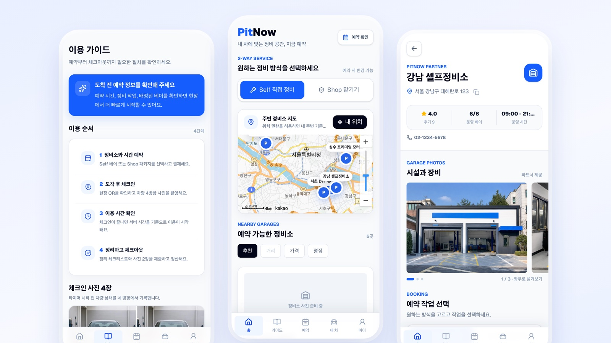
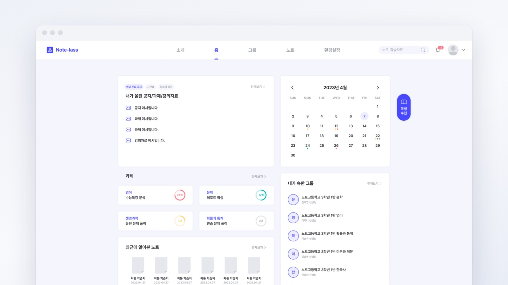
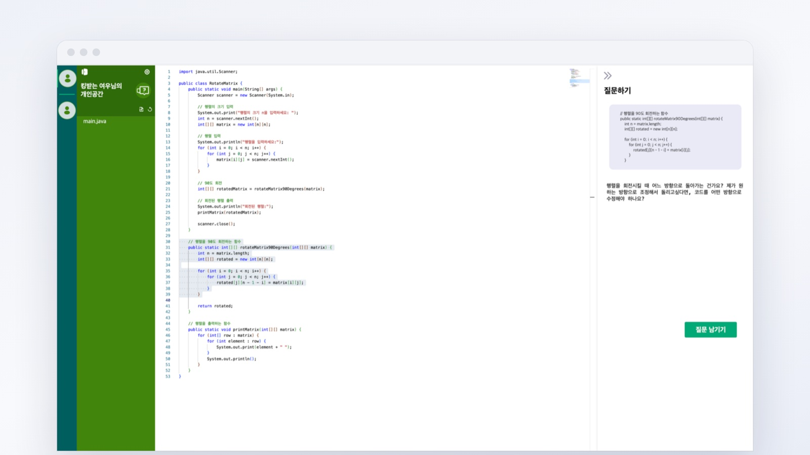

<div align="center">

<a href="https://portfolio-8t7o.vercel.app" title="포트폴리오 사이트로 이동"></a>

<br />

<a href="https://portfolio-8t7o.vercel.app" title="프로젝트 케이스 스터디와 이력서"></a>
<a href="https://portfolio-8t7o.vercel.app/writing" title="문제를 풀며 쓴 기술 글"></a>
<a href="mailto:lchj1999@gmail.com" title="lchj1999@gmail.com"></a>

</div>

<br />

```ts
const changjoon = {
  role: "Frontend Engineer",
  main: ["TypeScript", "React", "Next.js"],
  building: ["PitNow (2026.03 ~)", "CarFortune (2026.08 ~)"],
  career: "크루베이션 Frontend Engineer (2025.09 ~ 2026.02)",
  education: "동국대학교 불교학부, 컴퓨터공학 복수전공 (2026.02 졸업)",
  awards: "2023 G-HOP 대학창업연합 경진대회 대상 외 3건",
  portfolio: "https://portfolio-8t7o.vercel.app",
};
```

## Projects

<table>
  <tr>
    <td width="50%" valign="top">
      <a href="https://portfolio-8t7o.vercel.app/projects/pitnow" title="PitNow 케이스 스터디"></a>
      <h3>PitNow</h3>
      <sub>자동차 정비 예약 서비스 | 2026.03 ~ 진행 중 | 2인 팀, 개발 전담</sub>
      <p>예약 겹침을 PostgreSQL 배제 제약 조건으로 막고, 결제와 예약 데이터가 어긋난 경우를 매일 찾는 SQL 규칙을 만들었습니다.</p>
      <details>
        <summary><b>더 보기</b></summary>
        <ul>
          <li>고객 앱, 정비소 운영 화면, 내부 관리자 화면을 모두 개발했습니다.</li>
          <li>이용 요금은 서버 시각으로 30분 단위 올림 계산하고, 예약 상태를 상태 머신으로 정의해 중복 체크아웃 같은 잘못된 전환을 막았습니다.</li>
          <li>Claude API는 찾은 이상의 우선순위와 조치를 정리하는 데만 쓰고, 허용 목록에 있는 사실만 보냅니다.</li>
          <li>실제 마이그레이션 SQL을 PGlite에서 실행하는 테스트 8개와 Playwright E2E로 확인했습니다.</li>
        </ul>
      </details>
      <code>Next.js</code> <code>TypeScript</code> <code>Supabase</code> <code>Toss Payments</code> <code>Playwright</code>
      <p><a href="https://portfolio-8t7o.vercel.app/projects/pitnow">케이스 스터디</a> | <a href="https://pit-now.vercel.app">서비스</a></p>
    </td>
    <td width="50%" valign="top">
      <a href="https://portfolio-8t7o.vercel.app/projects/carfortune" title="CarFortune 케이스 스터디"></a>
      <h3>CarFortune</h3>
      <sub>Pleos Connect 차량용 운세 앱 | 2026.08 ~ 진행 중 | 개인 프로젝트</sub>
      <p>기어가 P가 아니면 화면을 잠그고, AI로 초안을 만든 콘텐츠 400건을 중복 검사와 법규 수치 교차 확인으로 검증했습니다.</p>
      <details>
        <summary><b>더 보기</b></summary>
        <ul>
          <li>현대자동차그룹 차량 플랫폼 Pleos Connect에서 동작합니다. 기획, 디자인, 개발을 혼자 맡았습니다.</li>
          <li>웹 프로토타입으로 차량 화면 규격(Connect-S, 1700x1184dp)에서 흐름을 먼저 검증했습니다.</li>
          <li>자카드 유사도로 근접 중복 26건, 도로교통공단과 국가법령정보센터 자료 대조로 사실 오류 4건을 걸러냈습니다.</li>
          <li>Android 앱은 mock 빌드와 Pleos 빌드를 나눴습니다.</li>
        </ul>
      </details>
      <code>Next.js</code> <code>TypeScript</code> <code>Kotlin</code> <code>Android Automotive</code>
      <p><a href="https://portfolio-8t7o.vercel.app/projects/carfortune">케이스 스터디</a></p>
    </td>
  </tr>
  <tr>
    <td width="50%" valign="top">
      <a href="https://portfolio-8t7o.vercel.app/projects/notelass" title="Notelass 케이스 스터디"></a>
      <h3>Notelass</h3>
      <sub>AI 생활기록부 작성 서비스 | 2023.07 ~ 2024.02 | 8인 팀, 프론트엔드 팀장</sub>
      <p>디자인 시스템과 PR 리뷰 기준을 만들어 프론트엔드 3명이 같은 방식으로 개발했습니다. 2023 G-HOP 대학창업연합 경진대회 대상을 받았습니다.</p>
      <details>
        <summary><b>더 보기</b></summary>
        <ul>
          <li>화면을 나눠 맡다 보니 같은 역할의 컴포넌트가 사람마다 조금씩 달라졌고, Atomic 디자인 패턴으로 공통 컴포넌트를 정리했습니다.</li>
          <li>성균관대 창업경진대회 1위, 아주대 창업경진대회 2위, 예비창업패키지에 선정됐습니다.</li>
          <li>팀을 떠날 때 코드 구조와 컴포넌트 규칙을 문서로 남겨 인수인계했습니다.</li>
        </ul>
      </details>
      <code>React</code> <code>Redux Toolkit</code> <code>styled-components</code>
      <p><a href="https://portfolio-8t7o.vercel.app/projects/notelass">케이스 스터디</a> | <a href="https://github.com/CWDll/notelass">저장소</a></p>
    </td>
    <td width="50%" valign="top">
      
      <h3>혜윰모듈</h3>
      <sub>라이브 코딩 실습 수업 플랫폼 | 2024.06 ~ 2024.08 | 산학연계, 4인 팀</sub>
      <p>학생 50~60명을 많아야 조교 2명이 한 명씩 확인하던 실습 수업을 바꾸자고 제안했습니다. 코드를 제출하면 실행 결과와 제출 시각이 함께 남습니다.</p>
      <details>
        <summary><b>더 보기</b></summary>
        <ul>
          <li>코드에서 궁금한 부분을 드래그하면 그 영역이 채팅방에 들어가 바로 질문할 수 있습니다(웹소켓).</li>
          <li>수업 중 오간 질문과 답변을 요약해 두고, 비슷한 질문이 나오면 그 요약으로 바로 답합니다.</li>
          <li>코드 작성 화면과 디자인 시스템을 맡았고, Monaco Editor를 화면에 맞게 고쳐 썼습니다.</li>
          <li>담당 교수님이 2~3주 동안 실제 실습 수업에서 사용했습니다.</li>
        </ul>
      </details>
      <code>React</code> <code>Monaco Editor</code> <code>WebSocket</code>
    </td>
  </tr>
</table>

<details>
  <summary><b>그 밖의 프로젝트</b></summary>
  <br />

| 프로젝트 | 기간 | 내용 |
| --- | --- | --- |
| 하트시그널 | 2023.10 | 대학 축제 익명 매칭과 채팅. 같은 인원수의 다른 성별 그룹만 보여 주는 매칭 조건을 구현했고, 축제 2일 동안 약 2,400명이 사용했습니다. GDGoC DGU, 10인 팀 |
| [아파투두](https://github.com/CWDll/2024-1-CECD1-isReal-4) | 2024 | 신축 아파트 하자 신청과 관리. 승인 내역을 블록체인에 기록합니다. 종합설계, 4인 팀. 같은 주제의 논문으로 우수논문상 |
| [항공 물류 스케줄 관리](https://github.com/CWDll/AirlineTransportFront) | 2024 | 화주와 항공사, 세관이 함께 쓰는 항공 화물 스케줄 관리. 소프트웨어공학, 6인 팀 |

</details>

## Experience

| 기간 | 소속 | 역할 |
| --- | --- | --- |
| 2025.09 ~ 2026.02 | 크루베이션 | Frontend Engineer. AI 취업 준비 서비스 텔링 개발과 운영 |
| 2023.09 ~ 2024.08 | GDGoC DGU 1기 | 프론트엔드 파트원, Solution Challenge 참여 |
| 2023.07 ~ 2024.02 | 대학 연합 창업동아리 | 프론트엔드 팀장, Notelass 개발 |
| 2023.05 ~ 2024.01 | Farm-System 2기 | 프론트엔드 파트원 |
| 2023.03 ~ 2023.09 | 멋쟁이사자처럼 동국대 11기 | 프론트엔드 파트원 |

## Awards

| 날짜 | 수상 | 수여 |
| --- | --- | --- |
| 2024.11 | 대학생 논문경진대회 우수논문상 | 한국정보기술학회 |
| 2024.01 | Farm 경진대회 우수상 | 동국대학교 SW교육원 |
| 2023.11 | 2023 G-HOP 대학창업연합 경진대회 대상 | 경기지방중소벤처기업청 |
| 2023.06 | 교내 해커톤 2위 | 동국대학교 SW교육원 |

## Writing

- [데이터 이상은 규칙으로 찾고, AI에게는 정리만 맡겼습니다](https://portfolio-8t7o.vercel.app/writing/ops-anomaly-daily-check)
- [예약 겹침을 코드가 아니라 데이터베이스에서 막은 이유](https://portfolio-8t7o.vercel.app/writing/booking-overlap-constraint)
- [모달을 닫을 때마다 목록 전체를 다시 불러오던 문제](https://portfolio-8t7o.vercel.app/writing/list-refetch-to-row-sync)
- [AI로 만든 콘텐츠 400개를 검증한 방법](https://portfolio-8t7o.vercel.app/writing/ai-content-verification)

## Tech Stack


<sub>그 밖에 React Query, Zustand, Recoil, Playwright, Toss Payments</sub>

<br />

<picture>
  <source media="(prefers-color-scheme: dark)" srcset="https://raw.githubusercontent.com/CWDll/CWDll/output/github-snake-dark.svg" />
  
</picture>
